

# מדריך לשימוש ב-Tidepool

מערכת ה-Tidepool הוא מערכת שמטרתה להנגיש את נתוני הסכרת לחולים ולמטפליהם.

המערכת מכילה שלשה רכיבים:

1. **Tidepool Web** -- אתר הנתונים, שהוזנו בצורת שונות לצרכי בקרה ומעקב ע"י המטופל ו/או צוות המטפלים
2. **Tidepool Uploader** -- תוכנה המותקנת על המחשב (PC או Mac), הטוענת נתונים [ממכשירים נתמכים](https://www.tidepool.org/users/devices) (מד סוכר, משאבה, סנסור, ועוד) ל-Tidepool Web
3. **Tidepool Mobile** (לא חובה) -- אפליקציה ל-iOS ו-Android המאפשרת הוספת הערות וצפייה בנתונים שב-Tidepool Web

## תאור התהליך

כדי להתחיל את השימוש ב-Tidepool יש לבצע את הפעולות הבאות באופן חד-פעמי:

1. התקן את דפדפן [Google Chrome](https://www.google.com/chrome/) (אם אינו מותקן).
2. הרשם ב[אתר הנתונים של Tidepool](https://app.tidepool.org/signup). הרישום אינו כרוך בתשלום, אך נדרש תיבת דוא"ל. (פירוט להלן)
3. [הורד](https://www.tidepool.org/download) והתקן את ה-Tidepool Uploader. (פירוט להלן)
4. (לא חובה) הורד והתקן את ה-Tidepool Mobile עבור iOS מה-[App Store](https://appsto.re/us/aXyl9.i) או עבור Android מ-[Google Play](https://play.google.com/store/apps/details?id=io.tidepool.urchin)
5. (לא חובה) אם ברשותך סנסור של Dexcom, [תוכל לטעון אוטומטית נתונים מהסנסור ע"י קביעת הגדרות ב-Tidepool Mobile](https://support.tidepool.org/hc/en-us/articles/360029369532-How-to-upload-your-data-with-Tidepool-Mobile)

לאחר מכן:

* השתמש ב-Tidepool Uploader להעלות נתונים ממכשירים שונים (פירוט להלן)
* צפה בנתונים שנטענו, באמצעות ה-Tidepool Web או ה-Tidepool Mobile

## רישום ל-Tidepool

1. הזן ב-Chrome את הכתובת https://tidepool.org/signup
2. בחר **Personal Account** (חשבון אישי, ולא חשבון מטפל), ואח"כ לחץ **Continue**.

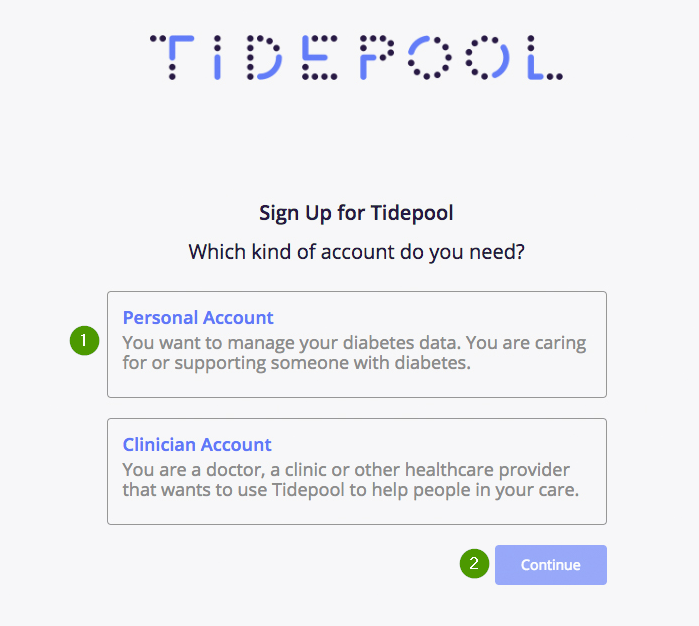

1. הזן שם מלא (**Full name**), דוא"ל (**Email**), וסיסמא (**Password**) בשדות המתאימים. הזן את הסיסמא שוב כדי לוודא אותה (**Confirm password**). לחץ על **Create Personal Account** (צור חשבון אישי).

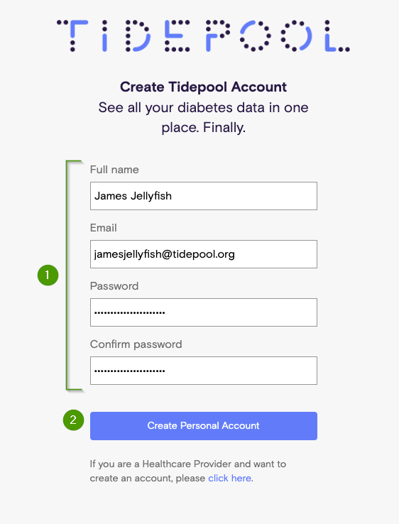

1. יישלח אליך מייל עם הכותרת "Verify your Tidepool Account". (אם אינך רואה מייל כזה, בדוק בתיקיית ספאם.) פתח את המייל ולחץ על **Verify your Account** כדי להשלים את יצירת החשבון.

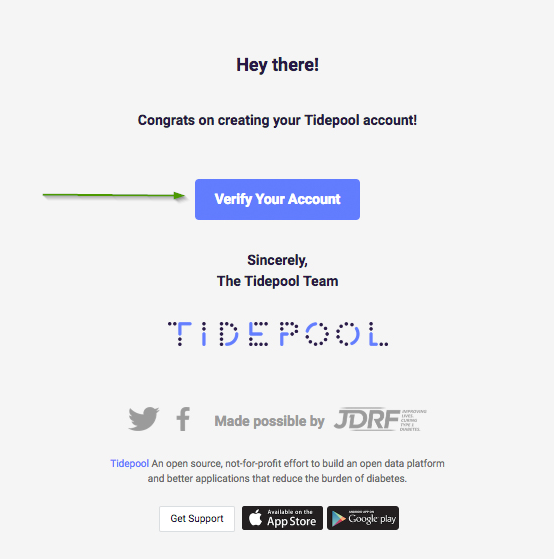

5. הזן את הסיסמא באתר הנתונים של Tidepool. אשר הסכמה לתנאי שימוש, ולחץ על **Continue**.

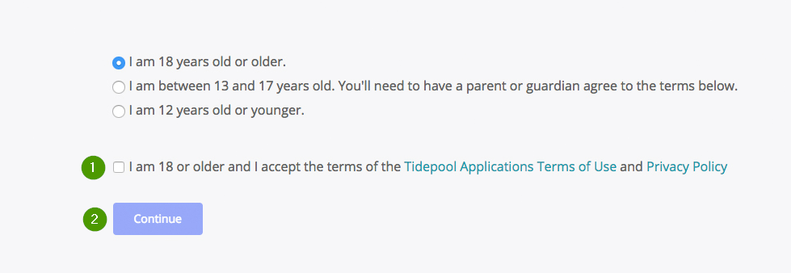

6. כדי להעלות נתונים לאתר של Tidepool יש לאפשר שמירת נתונים בחשבון. לחץ על **Yes, let's set it up**.

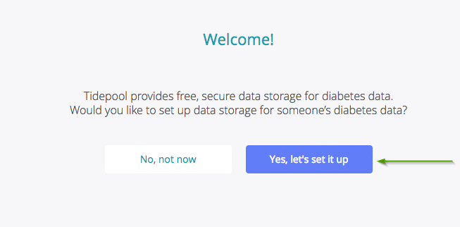

1. במסך הבא הזן כמה פרטים אודות הפציינט כדלהלן:

  | תאור | כותרת | מספר |
  | --- | --- | --- |
  | האם הנתונים שלך? | בחר **This is for me. I have diabetes** | 1 |
  | האם הנתונים של מישהו אחר? | בחר **This is for someone I care for who has diabetes** | 2 |
  | שם הפציינט | | 3 |
  | תאריך לידה | **Birthday** | 4 |
  | תאריך אבחון הסוכרת | **Diagnosis date** | 5 |
  | סוג הסוכרת | | 6 |
  | האם לתרום את הנתונים בצורה אנונימית למחקר ע"י פרוייקט ה-Big Data של Tidepool? | | 7 |
  | Tidepool מעבירה 10% מרווחיה לארגוני סוכרת לבחירתכם. אין חובה לבחור. | | 8 |

  לאחר מכן לחץ על **Save**.

  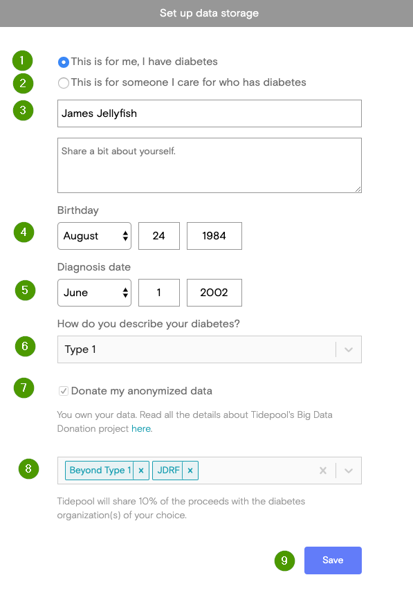

## התקנת ה-Tidepool Uploader

[הורד](https://tidepool.org/uploader) את הגירסא המתאימה למערכת ההפעלה (PC או Mac), והתקן.

* **עבור מחשבי PC (Windows)** במהלך ההתקנה יש לאשר התקנת הדרייברים:

  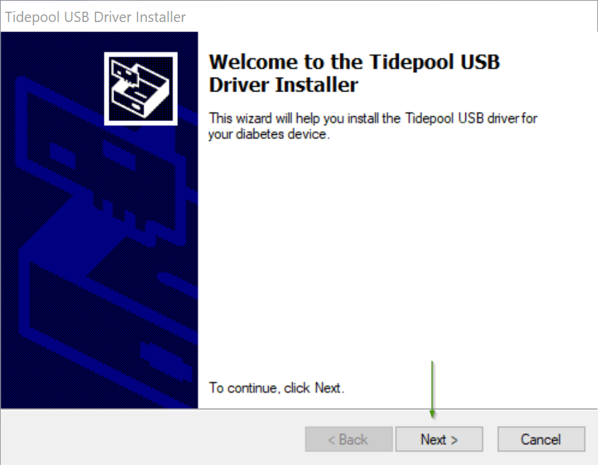

  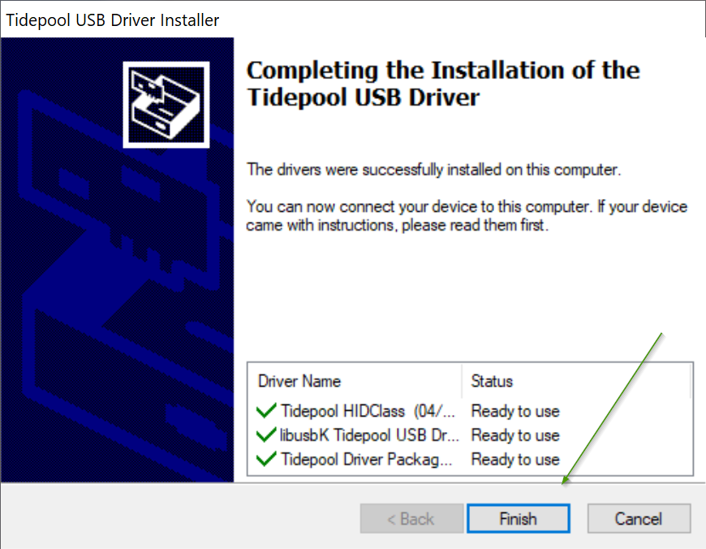

* **עבור מחשבי Mac** יש לגרור את Tidepool Uploader לתיקיית היישומים:

  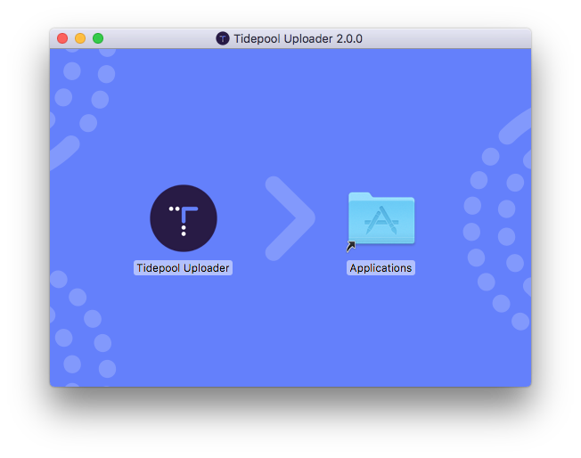

## שימוש ב-Tidepool Uploader

1. פתח את ה-Tidepool Uploader.
2. אם תתבקש, הזן דוא"ל וסיסמא, ואח"כ לחץ על **Log in**.

  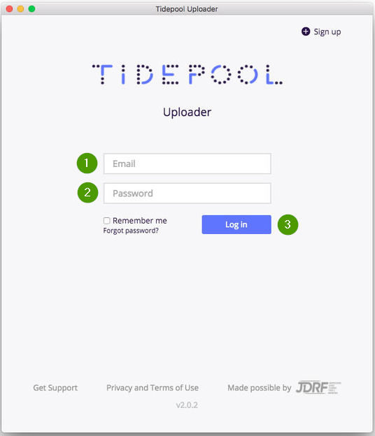

3. בדוק כי המכשירים הרלבנטיים מופיעים ברשימת המכשירים. כמו"כ בדוק שאזור הזמן מוגדר נכון.

  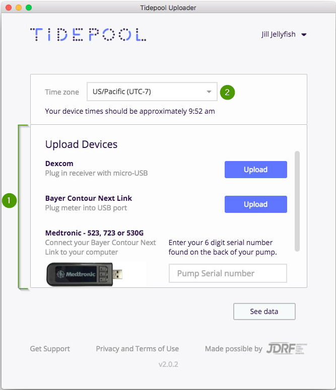

4. אם המכשיר לא מופיע, לחץ על התפריט ליד שם המשתמש, ובחר **Choose Device**.

  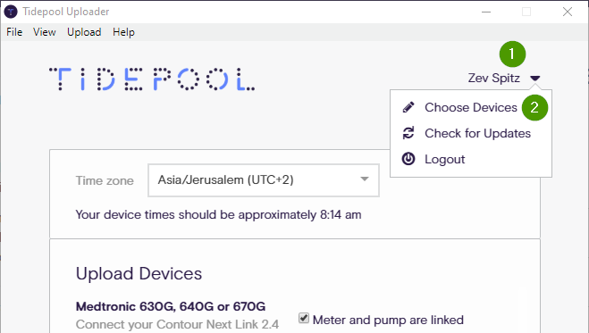

  תפתח רשימה של מכשירים שה-Tidepool תומך בהם, שבה תוכל לבחור מכשירים נוספים. לחץ על **Done** לסיום.

  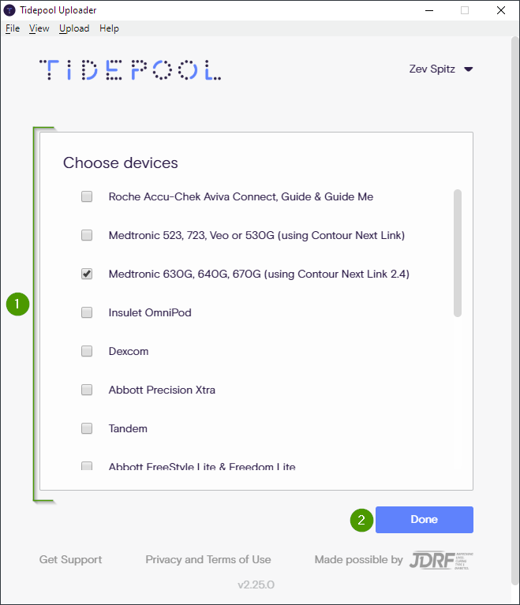

5. חבר את המכשיר למחשב, בהתאם להנחיות הכתובות ליד שם המכשיר ברשימה. פעולה זו שונה ממכשיר למכשיר, אבל התהליך דורש בדרך כלל חיבור המחכשיר למחשב (באמצעות כבל). לחץ על **Upload**.

המתן לסיום העלת הנתונים. לאחר מכן ניתן להעלות נתונים ממכשירים נוספים.

כדי לראות את הנתונים, אפשר ללחוץ על **See data**, או לגשת ל-https://app.tidepool.org/.

